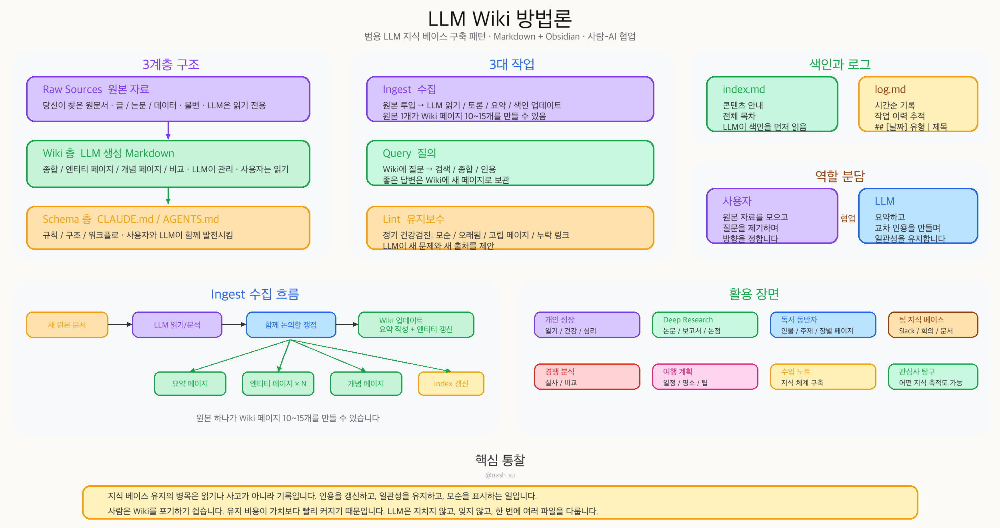
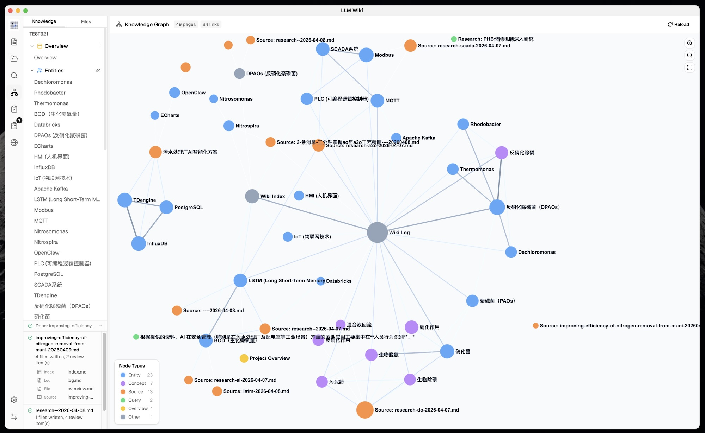
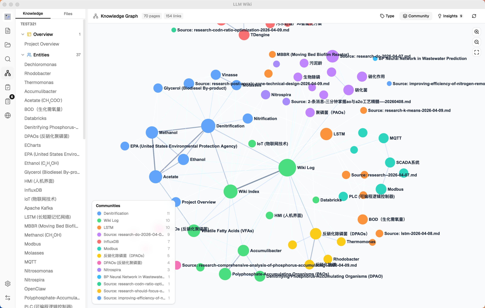
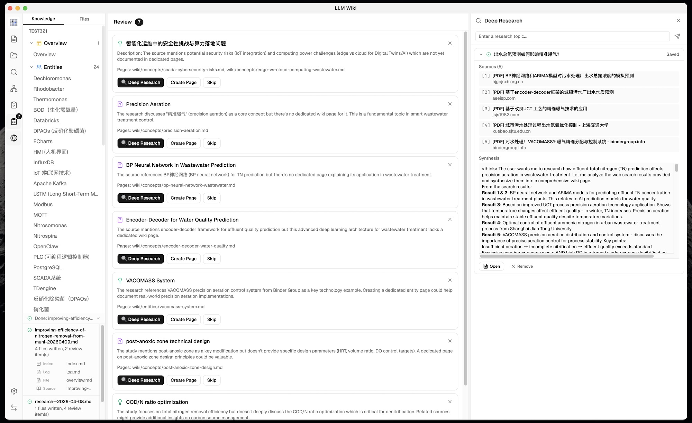

# LLM Wiki

<p align="center">
  
</p>

<p align="center">
  <strong>스스로 구축되는 개인 지식 베이스.</strong><br>
  LLM이 문서를 읽고 구조화된 Wiki를 만들며 계속 최신 상태로 유지합니다.
</p>

<p align="center">
  <a href="#이-프로젝트는-무엇인가요">이 프로젝트는 무엇인가요?</a> •
  <a href="#주요-기능">주요 기능</a> •
  <a href="#기술-스택">기술 스택</a> •
  <a href="#설치">설치</a> •
  <a href="#감사의-말">감사의 말</a> •
  <a href="#라이선스">라이선스</a>
</p>

<p align="center">
  <a href="README.md">English</a> | <a href="README_CN.md">中文</a> | 한국어
</p>

---

<p align="center">
  
</p>

## 주요 기능

- **2단계 Chain-of-Thought Ingest** — LLM이 먼저 분석하고, 그 결과를 바탕으로 출처 추적 가능한 Wiki 페이지를 생성합니다.
- **멀티모달 이미지 수집** — PDF 내장 이미지를 추출하고, 비전 LLM으로 사실 기반 캡션을 생성하며, 이미지 중심 검색과 원본 위치 이동을 지원합니다.
- **4-신호 지식 그래프** — 직접 링크, 출처 중복, Adamic-Adar, 타입 친화도를 함께 사용하는 관련도 모델입니다.
- **Louvain 커뮤니티 탐지** — 지식 클러스터를 자동으로 발견하고 응집도를 계산합니다.
- **그래프 인사이트** — 뜻밖의 연결과 지식 공백을 찾아 Deep Research로 이어줍니다.
- **벡터 의미 검색** — LanceDB 기반 선택형 embedding 검색이며 OpenAI 호환 endpoint를 사용할 수 있습니다.
- **영구 Ingest Queue** — 직렬 처리, crash recovery, 취소, 재시도, 진행 상황 표시를 지원합니다.
- **폴더 가져오기** — 폴더 구조를 유지하며 재귀적으로 가져오고, 폴더 경로를 LLM 분류 힌트로 사용합니다.
- **Deep Research** — LLM이 검색 주제를 최적화하고, 다중 웹 검색 결과를 Wiki로 자동 수집합니다.
- **비동기 Review 시스템** — LLM이 사람의 판단이 필요한 항목과 사전 생성 검색 쿼리를 제안합니다.
- **Chrome Web Clipper** — 웹 페이지를 한 번에 캡처하고 지식 베이스로 자동 수집합니다.
- **Obsidian 스타일 다크 모드** — System, Light, Dark 테마를 지원하며 다크 배경에서도 그래프 라벨과 연결선이 읽기 쉽게 조정됩니다.

## 이 프로젝트는 무엇인가요?

LLM Wiki는 문서를 자동으로 정리된 상호 연결 지식 베이스로 바꾸는 크로스 플랫폼 데스크톱 앱입니다. 전통적인 RAG처럼 매 질문마다 처음부터 검색하고 답하는 대신, LLM이 원본 자료를 바탕으로 **지속적으로 유지되는 Wiki를 점진적으로 구축**합니다. 지식은 한 번 컴파일되고 이후 계속 갱신됩니다.

이 프로젝트는 [Karpathy의 LLM Wiki 패턴](https://gist.github.com/karpathy/442a6bf555914893e9891c11519de94f)을 기반으로 합니다. 원래 문서는 LLM으로 개인 지식 베이스를 만드는 추상적 설계 패턴이고, 이 프로젝트는 그 아이디어를 실제 데스크톱 앱으로 구현한 버전입니다.

<p align="center">
  
</p>

## 감사의 말

기초 방법론은 **Andrej Karpathy**의 [llm-wiki.md](https://gist.github.com/karpathy/442a6bf555914893e9891c11519de94f)에서 왔습니다. 이 문서는 LLM으로 개인 Wiki를 점진적으로 구축하고 유지하는 패턴을 설명합니다. LLM Wiki 앱은 그 추상 패턴을 구체적인 제품 형태로 확장한 구현체입니다.

## 원본 설계에서 유지한 것

핵심 구조는 Karpathy의 설계를 충실히 따릅니다.

- **3계층 구조**: Raw Sources(불변 원본) → Wiki(LLM 생성) → Schema(규칙과 설정)
- **3가지 핵심 작업**: Ingest, Query, Lint
- **index.md**: 콘텐츠 카탈로그이자 LLM 탐색 진입점
- **log.md**: 파싱 가능한 형식의 시간순 작업 기록
- **[[wikilink]]**: 페이지 간 교차 참조
- **YAML frontmatter**: 모든 Wiki 페이지의 구조화 메타데이터
- **Obsidian 호환성**: wiki 디렉터리를 Obsidian vault처럼 사용할 수 있음
- **사람은 큐레이션, LLM은 유지관리**: 핵심 역할 분담

<p align="center">
  
</p>

## 변경 및 확장한 것

### 1. CLI 패턴에서 데스크톱 앱으로

원본은 LLM agent에게 붙여 넣어 사용할 수 있는 추상 패턴 문서였습니다. 이 프로젝트는 이를 **완성도 있는 크로스 플랫폼 데스크톱 애플리케이션**으로 만들었습니다.

- Knowledge Tree / File Tree, Chat, Preview로 구성된 3열 레이아웃
- Wiki, Sources, Search, Graph, Lint, Review, Deep Research, Settings를 오가는 아이콘 사이드바
- 좌우 패널 크기를 직접 조절할 수 있는 resizable panel
- 파일별 수집 진행 상황을 보여주는 Activity Panel
- 대화, 설정, review 항목, 프로젝트 설정의 영구 저장
- Research, Reading, Personal Growth, Business, General 시나리오 템플릿

### 2. purpose.md

원본에는 Wiki가 어떻게 동작해야 하는지에 대한 Schema는 있지만, Wiki가 **왜 존재하는지**를 공식적으로 담는 위치는 없었습니다. LLM Wiki는 `purpose.md`를 추가했습니다.

- 목표, 핵심 질문, 연구 범위, 발전 중인 관점을 기록
- Ingest와 Query 때 LLM이 맥락으로 읽음
- 사용 패턴에 따라 LLM이 업데이트를 제안 가능
- schema가 구조 규칙이라면 purpose는 방향과 의도


### 3. 2단계 Chain-of-Thought Ingest

단일 LLM 호출로 읽기와 쓰기를 동시에 처리하지 않고, 두 번의 순차 호출로 품질을 높입니다.

```text
1단계 분석: LLM이 원본 자료를 읽고 구조화 분석 생성
  - 핵심 엔티티, 개념, 주장
  - 기존 Wiki와의 연결
  - 모순과 긴장 관계
  - Wiki 구조 제안

2단계 생성: 분석 결과를 바탕으로 Wiki 파일 생성
  - source summary와 frontmatter
  - entity/concept 페이지와 cross-reference
  - index.md, log.md, overview.md 업데이트
  - 사람 판단이 필요한 review 항목
  - Deep Research용 검색 쿼리
```

추가 개선:

- SHA256 기반 증분 캐시로 변경 없는 원본은 자동 skip
- 앱 재시작 후에도 복구되는 영구 ingest queue
- 폴더 구조를 유지하는 recursive import
- 진행률, pending/processing/failed 상태, cancel/retry를 보여주는 queue visualization
- vector search 활성화 시 새 페이지 자동 embedding
- 모든 생성 페이지에 `sources: []` frontmatter를 추가해 원본 추적성 확보
- overview.md 자동 갱신
- LLM이 누락해도 source summary를 보장하는 fallback
- 사용자가 설정한 출력 언어를 따르는 language-aware generation

### 4. 지식 그래프와 관련도 모델

<p align="center">
  
</p>

원본은 `[[wikilink]]`를 언급하지만 그래프 분석 기능은 없습니다. LLM Wiki는 sigma.js와 graphology 기반의 시각화 및 관련도 엔진을 제공합니다.

| 신호 | 가중치 | 설명 |
|------|--------|------|
| 직접 링크 | x3.0 | `[[wikilink]]`로 연결된 페이지 |
| 출처 중복 | x4.0 | frontmatter `sources[]`가 겹치는 페이지 |
| Adamic-Adar | x1.5 | 공통 이웃을 공유하는 페이지 |
| 타입 친화도 | x1.0 | entity-entity, concept-concept 같은 타입 보너스 |

그래프는 페이지 타입 또는 커뮤니티별 색상, link count 기반 node size, hover highlight, zoom controls, 위치 캐시, legend를 지원합니다.

### 5. Louvain 커뮤니티 탐지

Louvain 알고리즘으로 지식 클러스터를 자동 발견합니다.

- 링크 구조를 바탕으로 자연스러운 클러스터 발견
- 타입 색상과 커뮤니티 색상 전환
- 클러스터별 응집도 점수 계산
- 낮은 응집도 클러스터 경고
- 12색 팔레트와 커뮤니티 legend

<p align="center">
  
</p>

### 6. Graph Insights

그래프 구조를 분석해 실행 가능한 인사이트를 보여줍니다.

- 서로 다른 커뮤니티나 타입 사이의 뜻밖의 연결 감지
- 연결이 약한 페이지, sparse community, bridge node 같은 지식 공백 탐지
- insight card 클릭 시 관련 node와 edge highlight
- 지식 공백에서 Deep Research를 바로 시작
- 연구 주제와 검색 쿼리는 시작 전 수정 가능

<p align="center">
  
</p>

### 7. 최적화된 Query Retrieval Pipeline

질문에 답할 때 단순 keyword search만 쓰지 않고 여러 단계를 거칩니다.

```text
1단계: Tokenized Search
  - 영어 단어 분리와 stop word 제거
  - 중국어 CJK bigram tokenization
  - title match bonus
  - wiki와 raw/sources 모두 검색

1.5단계: Vector Semantic Search(선택)
  - OpenAI 호환 /v1/embeddings endpoint
  - LanceDB에 embedding 저장
  - keyword가 겹치지 않아도 의미적으로 가까운 페이지 탐색

2단계: Graph Expansion
  - 상위 검색 결과를 seed로 삼아 관련 페이지 확장
  - 2-hop traversal과 decay 적용

3단계: Budget Control
  - 4K부터 1M token까지 context window 설정
  - Wiki, chat history, index, system prompt 예산 배분

4단계: Context Assembly
  - 전체 페이지 본문을 번호와 함께 조립
  - purpose.md, language rule, citation format, index.md 포함
  - LLM은 [1], [2]처럼 번호로 인용
```

Vector Search는 기본 비활성화이며, Settings에서 endpoint, API key, model을 별도로 설정해 켤 수 있습니다.

### 8. 영구 저장되는 다중 대화 Chat

- 독립적인 chat session 생성, 이름 변경, 삭제
- 대화별 sidebar 전환
- `.llm-wiki/chats/{id}.json`에 conversation 저장
- context로 보낼 history depth 설정
- 답변마다 사용된 wiki page reference panel 제공
- valuable answer를 `wiki/queries/`에 저장하고 auto-ingest 가능

### 9. Thinking / Reasoning Display

DeepSeek, QwQ처럼 `<think>` block을 출력하는 모델을 위해 reasoning 표시를 지원합니다.

- 생성 중 rolling 5-line thinking 표시
- 완료 후 기본 접힘 상태
- 본문 답변과 분리된 시각 스타일

### 10. KaTeX 수식 렌더링

- inline `$...$`, block `$$...$$` 수식 렌더링
- Milkdown math plugin 지원
- LaTeX 환경 자동 감지
- 간단한 symbol unicode fallback

### 11. 비동기 Human-in-the-Loop Review

- Ingest 중 LLM이 사람 판단이 필요한 항목을 표시
- Create Page, Deep Research, Skip 같은 제한된 action 제공
- 각 review item에 검색 쿼리 사전 생성
- Ingest를 막지 않고 사용자가 나중에 처리 가능

### 12. Deep Research

<p align="center">
  
</p>

- Tavily API 기반 웹 검색과 본문 추출
- 주제당 다중 검색 쿼리
- Graph Insights에서 시작하면 overview.md와 purpose.md를 읽어 domain-aware topic 생성
- 시작 전 topic과 search query를 확인 및 수정
- LLM이 연구 결과를 Wiki research page로 합성
- 연구 결과 auto-ingest로 entity/concept 추출
- 최대 3개 동시 task와 streaming progress panel 지원

### 13. Browser Extension(Web Clipper)

<p align="center">
  
</p>

- Mozilla Readability.js로 article 추출
- Turndown.js로 HTML을 Markdown으로 변환
- project picker로 대상 Wiki 선택
- local HTTP API(port 19827)로 extension과 app 통신
- clipping 후 자동 ingest
- app이 실행 중이 아니어도 추출 결과 preview 가능

### 14. 다양한 문서 형식 지원

| 형식 | 처리 방식 |
|------|-----------|
| PDF | pdf-extract(Rust), file caching |
| DOCX | docx-rs, heading/list/table 보존 |
| PPTX | ZIP + XML 기반 slide별 추출 |
| XLSX/XLS/ODS | calamine, multi-sheet와 cell type 지원 |
| Images | native preview |
| Video/Audio | built-in player |
| Web clips | Readability.js + Turndown.js |

### 15. 삭제와 cascade cleanup

- 원본 source 삭제 시 source summary page 제거
- frontmatter `sources[]`, source summary 이름, frontmatter section reference로 관련 페이지 탐색
- 여러 source에 공유된 entity/concept는 삭제하지 않고 source만 제거
- index.md에서 삭제된 페이지 제거
- 남은 페이지의 죽은 `[[wikilink]]` 정리

### 16. 설정 가능한 Context Window

- 4K부터 1M token까지 조절
- 큰 window에서는 더 많은 wiki content 포함
- wiki pages / chat history / index / system prompt 예산 배분

### 17. 크로스 플랫폼 지원

- path normalization으로 Windows backslash 처리
- CJK filename에서도 안전한 unicode string handling
- macOS close-to-hide 동작
- Windows/Linux 종료 확인 dialog
- Tauri v2 기반 macOS, Windows, Linux native app
- GitHub Actions CI/CD로 macOS, Windows, Linux build

### 18. 기타 기능

- **i18n** — 영어, 중국어 UI 지원
- **Settings persistence** — LLM provider, API key, model, context size, language, UI theme 저장
- **Obsidian config** — `.obsidian/` 디렉터리와 권장 설정 자동 생성
- **Markdown rendering** — GFM table, code block, wikilink 처리
- **Multi-provider LLM** — OpenAI, Anthropic, Google, Ollama, Custom
- **15분 timeout** — 긴 ingest 작업 보호
- **dataVersion signaling** — Wiki 변경 시 graph와 UI 자동 refresh

## 기술 스택

| 계층 | 기술 |
|------|------|
| Desktop | Tauri v2(Rust backend) |
| Frontend | React 19 + TypeScript + Vite |
| UI | shadcn/ui + Tailwind CSS v4 |
| Editor | Milkdown(ProseMirror 기반 WYSIWYG) |
| Graph | sigma.js + graphology + ForceAtlas2 |
| Search | tokenized search + graph relevance + optional vector(LanceDB) |
| Vector DB | LanceDB(Rust, embedded, optional) |
| PDF | pdf-extract |
| Office | docx-rs + calamine |
| i18n | react-i18next |
| State | Zustand |
| LLM | Streaming fetch(OpenAI, Anthropic, Google, Ollama, Custom) |
| Web Search | Tavily API |

## 설치

### 사전 빌드된 바이너리

[Releases](https://github.com/nashsu/llm_wiki/releases)에서 다운로드합니다.

- **macOS**: `.dmg`(Apple Silicon + Intel)
- **Windows**: `.msi`
- **Linux**: `.deb` / `.AppImage`

### 소스에서 빌드

```bash
# 필요 조건: Node.js 20+, Rust 1.70+
git clone https://github.com/nashsu/llm_wiki.git
cd llm_wiki
npm install
npm run tauri dev      # 개발 실행
npm run tauri build    # 프로덕션 빌드
```

### 설치 앱 검증

ingest, review, graph처럼 실제 운영 품질에 영향을 주는 로직을 바꾼 뒤에는 `npm run build`만으로 끝내지 않습니다. 앱을 설치하고 실행한 다음, 실행 중인 번들이 최신 `/Applications/LLM Wiki.app`인지 확인합니다.

```bash
npm run install:macos
open -a "LLM Wiki"
npm run verify:macos-app
```

`install:macos`는 로컬 개발 설치 경로입니다. 기존 앱을 백업하고, 필요하면 legacy bundle id `com.llmwiki.app`의 macOS support 데이터를 `com.llmwiki.desktop`으로 마이그레이션하며, WebView/cache 상태를 비우고, ad-hoc signing 후 설치 앱을 잠급니다. `verify:macos-app`은 폴더명 변경 전 stale build marker를 확인하고, strict signature 검증이 이미 유효하지 않을 때만 target bundle에 ad-hoc signing을 수행합니다.

이 흐름은 공개 배포용 signing/notarization이 아닙니다. Developer ID signing, notarization, hardened runtime, release certificate 처리는 로컬 install/verify 스크립트가 아니라 별도 release script 또는 CI job으로 분리해야 합니다.

Vault까지 함께 증명하려면 큐 처리, stale missing-page review, unresolved wikilink 검사용 경로를 넘깁니다.

```bash
LLM_WIKI_VERIFY_VAULT="/path/to/LLM WIKI Vault" \
LLM_WIKI_VERIFY_SOURCE="local-deep-researcher.md" \
LLM_WIKI_VERIFY_PAGES="wiki/sources/local-deep-researcher-source.md,wiki/entities/local-deep-researcher.md,wiki/index.md" \
npm run verify:macos-app
```

실제 Vault를 외부로 보내지 않고 Gemini ingest live 경로만 확인하려면 합성 fixture 모드를 사용합니다.

```bash
npm run smoke:live-ingest -- --fixture
```

real Vault 대상 live smoke는 runtime proof 파일을 쓰고 source/context 내용을 설정된 LLM provider로 보내므로, 명시적인 운영 판단이 있을 때만 실행합니다.

### Chrome Extension

1. `chrome://extensions`를 엽니다.
2. Developer mode를 켭니다.
3. Load unpacked를 클릭합니다.
4. `extension/` 디렉터리를 선택합니다.

## 빠른 시작

1. 앱 실행 후 새 프로젝트를 만들고 템플릿을 선택합니다.
2. **Settings**에서 LLM provider, API key, model을 설정합니다.
3. **Sources**에서 PDF, DOCX, Markdown 등 문서를 가져옵니다.
4. **Activity Panel**에서 LLM이 Wiki 페이지를 만드는 과정을 확인합니다.
5. **Chat**으로 지식 베이스에 질문합니다.
6. **Knowledge Graph**에서 연결 관계를 살펴봅니다.
7. **Review**에서 사람 판단이 필요한 항목을 처리합니다.
8. **Lint**를 주기적으로 실행해 Wiki 건강 상태를 점검합니다.

## 프로젝트 구조

```text
my-wiki/
├── purpose.md              # 목표, 핵심 질문, 연구 범위
├── schema.md               # Wiki 구조 규칙, page type
├── raw/
│   ├── sources/            # 업로드한 원본 문서(불변)
│   └── assets/             # 로컬 이미지
├── wiki/
│   ├── index.md            # 콘텐츠 카탈로그
│   ├── log.md              # 작업 기록
│   ├── overview.md         # 전체 요약(자동 갱신)
│   ├── entities/           # 사람, 조직, 제품
│   ├── concepts/           # 이론, 방법, 기술
│   ├── sources/            # 원본 요약
│   ├── queries/            # 저장된 chat answer와 research
│   ├── synthesis/          # cross-source analysis
│   ├── comparisons/        # 비교 분석
├── .obsidian/              # Obsidian vault 설정(자동 생성)
└── .llm-wiki/              # 앱 설정, chat history, review item
```

참고: 외부 Codex 워크플로가 같은 vault 최상위에 `codex-memory/`를 두더라도, LLM Wiki App은 이 폴더를 표시, ingest, 검색, chat context 대상으로 사용하지 않습니다.

## Star History

<a href="https://www.star-history.com/?repos=nashsu%2Fllm_wiki&type=date&legend=top-left">
 <picture>
   <source media="(prefers-color-scheme: dark)" srcset="https://api.star-history.com/chart?repos=nashsu/llm_wiki&type=date&theme=dark&legend=top-left" />
   <source media="(prefers-color-scheme: light)" srcset="https://api.star-history.com/chart?repos=nashsu/llm_wiki&type=date&legend=top-left" />
   
 </picture>
</a>

## 라이선스

이 프로젝트는 **GNU General Public License v3.0**으로 배포됩니다. 자세한 내용은 [LICENSE](LICENSE)를 확인하세요.
