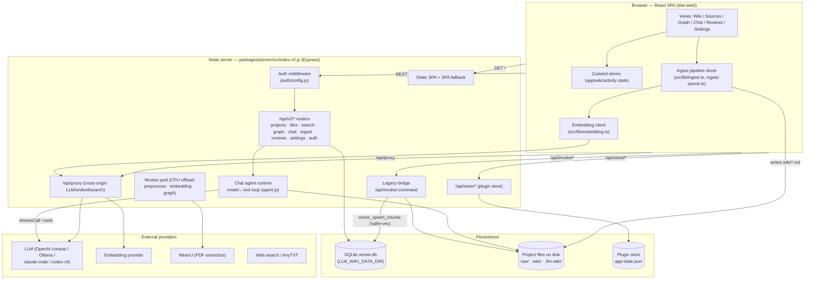
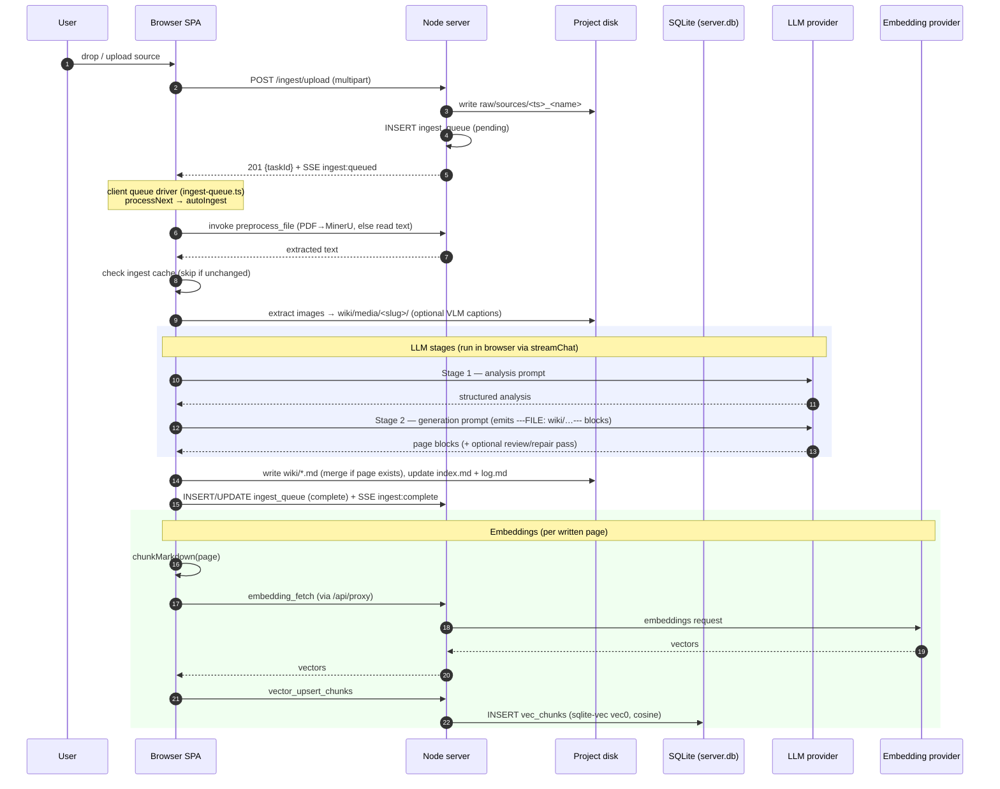
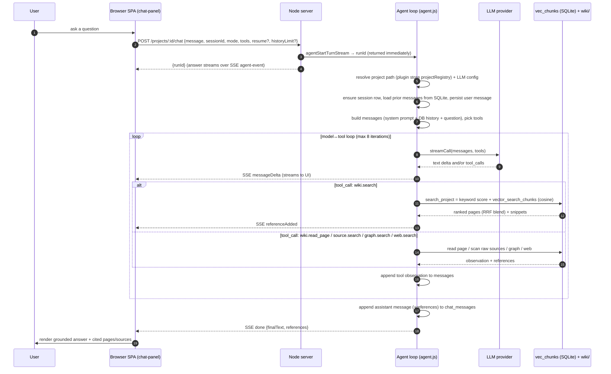

# LLM Wiki — Actual Architecture After PR #1 (As-Built)

> **Note:** This documents the **actual architecture status after PR #1** — the
> system as it was really built and merged, including where it diverges from the
> original design. The chartered V1 design it was built against is
> [V1_CHARTERED_ARCHITECTURE.md](../V1_CHARTERED_ARCHITECTURE.md); the open gaps
> between the two are tracked in issue #14.

High-level architecture of the web deployment, what lives in the database vs on
disk, and end-to-end dataflows for the two core operations: **ingest** (raw
document → wiki pages + embeddings) and **Q&A / chat** (question → grounded
answer).

> Scope: the **web client + Node server** stack (`packages/server` + the React
> SPA in `src/`, built to `dist-web/`). The desktop (Tauri) app shares the same
> on-disk project format and plugin store; differences are noted where relevant.

---

## 1. High-level architecture

Three runtime tiers plus external providers:



### Tier responsibilities

| Tier | What it does | Key files |
|---|---|---|
| **Browser SPA** | UI; holds app state; **drives the ingest LLM pipeline client-side**; renders streaming chat; computes embeddings via the proxy. | `src/` (views, `src/lib/ingest.ts`, `src/lib/embedding.ts`, `src/lib/llm-client.ts`) |
| **Node server** | Serves the SPA; exposes the API; runs the **chat agent loop server-side**; auth; SQLite access; CPU-offload worker pool; cross-origin proxy. | `packages/server/src/index-v2.js`, `api/*`, `agent.js`, `store/db.js`, `workers/` |
| **Persistence** | SQLite (relational metadata + embedding vectors via sqlite-vec), project files on disk (actual content), plugin store (config). | see §2 |
| **External** | LLM, embedding model, MinerU PDF extraction, web/AnyTXT search. | configured in plugin store / env |

**Important division of labor:** the heavy LLM work for *ingest* runs in the
**browser** (the server worker pool only offloads CPU tasks — binary parsing,
embedding fetch, graph build). The LLM work for *chat* runs **server-side** in
the agent runtime. Both call the same external LLM providers.

---

## 2. What is stored where

### 2a. SQLite — `server.db` (under `LLM_WIKI_DATA_DIR`, `/data` in Docker)

Relational **metadata**. Live schema (12 migrations applied):

| Table | Purpose | Status |
|---|---|---|
| `projects` | Registered projects (uuid, name, path, owner) | used |
| `users` | Local user accounts (username, password_hash) | used |
| `settings` | Per-user key/value settings | used |
| `ingest_queue` | Server-side ingest task queue (upload → pending/done) | used |
| `reviews` | Review items (type, title, status) | used |
| `chat_sessions` | Chat session metadata (uuid, project_id, title, timestamps) | used |
| `chat_messages` | Chat message history (role, content, references JSON) | used |
| `graph_nodes` / `graph_edges` | Knowledge-graph cache (path, title, type, link_count; weighted edges) | written when the graph is built |
| `vec_chunks` | Embedding chunks — sqlite-vec **vec0 virtual table** (`chunk_id` PK, `project_id`/`page_id`/`chunk_index`/`chunk_text`/`heading_path`, `embedding FLOAT[dim]`, cosine distance) | used when the sqlite-vec extension loads (see note) |
| `vec_meta` | Current vector-index dimensionality (single row, `id = 1`) | used to drop/recreate `vec_chunks` when the embedding dimension changes |
| `_migrations` | Applied migration bookkeeping | used |

> **Note on `vec_chunks`:** embeddings are stored **in SQLite** via the
> [sqlite-vec](https://github.com/asg017/sqlite-vec) extension (issue #14).
> Migration `012` replaces the old placeholder table with a vec0 virtual table
> plus `vec_meta`. The extension is loaded best-effort in `getDb()`; if it
> fails to load (unsupported platform, extension missing), the server **degrades
> to keyword-only retrieval** and search responses carry a
> `vectorUnavailableReason` — requests never fail. The legacy per-project
> `.llm-wiki/vectorstore.json` is no longer written or read; upgrading a project
> means re-running "Re-index all pages" (or a fresh ingest). Dimension changes
> (different embedding model) drop and recreate the table via `vec_meta`.

> **Note on `chat_*`:** chat history **is persisted to SQLite** (issue #21).
> Sessions are created lazily on the first turn of a conversation (keyed by the
> client's locally generated session UUID) and every completed turn appends its
> user/assistant messages; the client loads history back over the session
> endpoints instead of re-sending it. The desktop/web client additionally keeps
> its own file-based copies (`.llm-wiki/conversations.json`,
> `.llm-wiki/chats/<id>.json`); in the web build the server DB is the source of
> truth and the sidebar merges server sessions with any file-only conversations.

### 2b. Project files on disk — `<project>/`

The actual knowledge-base content:

```
<project>/
├── raw/sources/            # uploaded source documents (+ .cache/ for MinerU)
├── wiki/                   # generated markdown pages (the knowledge base)
│   ├── *.md                # concept / query / source-summary pages
│   ├── media/<slug>/       # images extracted from sources
│   ├── index.md            # deterministic wiki index
│   └── log.md              # append-only ingest log
└── .llm-wiki/              # per-project app state
    ├── vectorstore.json    # legacy embeddings (pre-sqlite-vec; no longer written or read — re-index to migrate)
    ├── ingest-queue.json   # client-side ingest queue
    ├── ingest-cache.json   # skip-unchanged-source cache
    ├── image-caption-cache.json
    └── history/<hash>.json # file-history snapshots (human + agent edits)
```

### 2c. Plugin store — `app-state.json`

Configuration shared with the desktop app when co-located (resolved by
`store.js`; overridable via `LLM_WIKI_STORE_FILE` / `LLM_WIKI_NO_SHARE`):
LLM provider config, embedding config, the **global retrieval mode**
(`wikiSearchMode` — `keyword` / `vector` / `hybrid`, enforced server-side on
every search; the desktop Rust backend ignores this key), search/AnyTXT config,
the API auth token
(`apiConfig.token`), and the project registry (`projectRegistry` — maps project
id → path, used by the chat agent to locate a project on disk).

---

## 3. Dataflow — Ingest (raw document → wiki pages + embeddings)

Triggered by dropping/uploading a source. The **browser drives the LLM
pipeline**; the server handles upload, queue bookkeeping, and CPU offload.



### Stages (client: `src/lib/ingest.ts` → `autoIngestImpl`)

1. **Upload + enqueue** (server) — `api/ingest.js`: write to `raw/sources/`,
   insert `ingest_queue`, emit `ingest:queued`.
2. **Extract/preprocess** — MinerU for PDFs (`mineru.ts`, cached to
   `raw/sources/.cache/`); otherwise `preprocess_file` (server `commands/preprocess.js`).
3. **Cache check** — `ingest-cache.ts` skips unchanged sources.
4. **Images** — extract to `wiki/media/<slug>/`; optional VLM captioning.
5. **LLM analysis** (Stage 1) — `streamChat` + `buildAnalysisPrompt`.
6. **LLM generation** (Stage 2) — `streamChat` + `buildGenerationPrompt`,
   emitting `---FILE: wiki/…---` blocks; optional review/repair passes.
7. **Write wiki pages** — `writeFileBlocks` (path-guarded, sanitized); existing
   pages merged via LLM (`page-merge.ts`); `index.md`/`log.md` updated
   deterministically.
8. **Embeddings** — `embedPage` per written page → chunk → `embedding_fetch` →
   `vector_upsert_chunks` → `vec_chunks` (sqlite-vec vec0 in SQLite).

**Artifacts:** disk (`raw/sources/`, `wiki/*.md`, `wiki/media/`,
`.llm-wiki/` caches) and SQLite (`ingest_queue`, `vec_chunks`).

---

## 4. Dataflow — Q&A / Chat (question → grounded answer)

Chat runs a **server-side agentic model↔tool loop**. Retrieval is **hybrid** by
default: keyword scoring + vector cosine search, fused with
reciprocal-rank-fusion (RRF). The retrieval mode is configurable
(`wikiSearchMode`: `keyword` / `vector` / `hybrid`) and resolved **server-side**
so it applies to the search UI, the chat agent, and the v1/v2 API alike.



### How it works

1. **Request** — `api/chat.js` validates the body and calls
   `agentStartTurnStream`; the `runId` returns immediately and the turn runs
   asynchronously, streaming `agent-event` payloads over SSE.
2. **Agent loop** (`agent.js` → `runLoop`, max 8 iterations) — builds the
   message list (system prompt + **server-loaded history** + the question),
   selects tools (`wiki.search`, `wiki.read_page`, `source.search`,
   `graph.search`; plus `web.search`/`anytxt.search` if enabled), and loops:
   call the LLM → if it returns tool calls, execute them and feed observations
   back → until the model answers with no further tool calls.
3. **Retrieval** — the `wiki.search` tool calls `search_project`
   (`commands/search.js`). The **retrieval mode** is resolved server-side:
   explicit request param → plugin store `wikiSearchMode` → default `hybrid`.
   - **keyword** scoring (title/body token matches + graph expansion), and
   - **vector** search — `vector_search_chunks` over the sqlite-vec `vec_chunks`
     vec0 table (`MATCH embedding` + `project_id` filter, cosine distance),
   - combined with **reciprocal-rank-fusion** into one ranked list.
   When the vector leg cannot run (extension not loaded, no embedding provider,
   embedding request failed), search **degrades to keyword results** and the
   response carries `vectorUnavailableReason` — the request itself never fails.
   In `vector` mode a failed vector leg also falls back to keyword (with the
   reason) rather than returning nothing.
4. **References** — every tool result contributes references (wiki pages,
   sources, graph nodes, web results); they are deduped and attached to the
   final answer, which the UI renders as citations.
5. **Deep mode** — brackets the retrieval phase with `deep_research.run`
   start/end events; does not force web search on (still gated by `tools.web`).
6. **Shell tools** — `shell.exec` is gated behind an active skill + per-command
   approval policy (or `LLM_WIKI_ALLOW_SHELL=1`).

**Persistence:** chat turns **are written to SQLite** (issue #21). A session
row is ensured on the first turn of a conversation (client-generated session
UUID, unique-indexed); the user message is persisted at turn start and the
assistant message (with its references JSON) at turn completion — never per
streamed delta, so a cancelled or errored turn leaves just the user message.
History for the next turn is loaded from `chat_messages` capped at
`historyLimit` (client setting, default 10; server default 20). The `:id`
segment accepts either the integer projects-table id or the project UUID; the
UUID path resolves via the plugin-store registry and materializes the
projects row (`chat_sessions`' FK target) on demand. A `resume: true`
re-send (approval/continuation scaffolding) skips persisting the user
message. Session CRUD: list/create/get/rename/delete under
`/projects/:id/chat/sessions`, with cross-project access returning 404.

---

## 5. Key architectural notes

- **Two LLM execution sites.** Ingest LLM calls run in the **browser**
  (`streamChat`); chat LLM calls run **server-side** (`agent.js`). Both target
  the same configured providers. Cross-origin browser calls go through
  `/api/proxy`.
- **Vectors live in SQLite via sqlite-vec** (web, issue #14). `vec_chunks` is a
  sqlite-vec vec0 virtual table loaded best-effort in `getDb()`; if the
  extension cannot load the server keeps working with keyword-only retrieval
  and answers carry `vectorUnavailableReason`. The legacy
  `.llm-wiki/vectorstore.json` file store is no longer used.
- **Retrieval mode is a server-enforced setting.** `wikiSearchMode`
  (`keyword` / `vector` / `hybrid`, default `hybrid`) is stored in the shared
  plugin store and resolved server-side on every search, so the search UI, the
  chat agent, and the v1/v2 endpoints all honor it without client-side wiring.
  Settings → Embeddings exposes the selector.
- **Chat is persisted (web).** Sessions and messages live in SQLite
  (`chat_sessions`/`chat_messages`, issue #21); the server owns history in the
  web build, and the desktop build keeps its client-held history re-send and
  file persistence untouched.
- **Single-process server.** `index-v2.js` serves the SPA, the v2 REST API, and
  the legacy `/api/invoke/*` bridge in one process — no second service needed.
- **Auth** (`auth/config.js`): `LLM_WIKI_AUTH_MODE` is the chartered primary
  (`none` → open, `token` → required, `open` normalized to `none`; the
  docker-compose default), `AUTH_MODE` a deprecated warn-once alias — the
  primary wins when both are set; unset (**auto**) → open when no token is
  configured, required once a token is set (env `LLM_WIKI_API_TOKEN` or
  plugin-store `apiConfig.token`).
- **API contract is a single source of truth** (`packages/api-types`, issue #20).
  The Zod schemas in `packages/api-types/src/schemas/` define the wire format
  once: the server (plain JS) imports the **built** schemas to validate requests,
  and the web client consumes the same package's `z.infer` types and error codes
  (`ERROR_CODES` — the server's `ErrorCode` is derived from them, no hand-mirror).
  One schema source, two consumers, so server validation and client types cannot
  drift. The OpenAPI document (`/api/v2/openapi.json`) is generated from these
  same schemas. CI and Docker build `@llm-wiki/api-types` before the server and
  the web client.
- **Shared state with desktop.** When the server runs on the same host as the
  desktop app, it reads/writes the desktop's plugin store so settings stay in
  sync; disable with `LLM_WIKI_NO_SHARE=1`.

---

## 6. Quick reference — endpoints used above

| Flow | Endpoint | Handler |
|---|---|---|
| Ingest upload | `POST /api/v2/projects/:id/ingest/upload` | `api/ingest.js` |
| Ingest queue | `GET/POST /api/v2/projects/:id/ingest/queue[…]` | `api/ingest.js` |
| Chat turn | `POST /api/v2/projects/:id/chat` | `api/chat.js` → `agent.js` |
| Chat cancel | `POST /api/v2/projects/:id/chat/:runId/cancel` | `api/chat.js` |
| Chat sessions | `GET/POST /api/v2/projects/:id/chat/sessions`, `GET/PATCH/DELETE …/:sessionId` | `api/chat.js` → `store/chat-sessions.js` |
| Search | `POST /api/invoke/search_project` (via bridge) | `commands/search.js` |
| Embeddings | `POST /api/proxy` + `embedding_fetch` / `vector_upsert_chunks` | `proxy.js`, `commands/search.js`, `commands/vectorstore.js` |
| Events (SSE) | `GET /api/v2/events` | `api/events.js` |
| Health | `GET /api/v2/health` | `index-v2.js` |

See [API_REFERENCE.md](./API_REFERENCE.md) for the full endpoint inventory and
[DEPLOYMENT.md](./DEPLOYMENT.md) for hosting.
